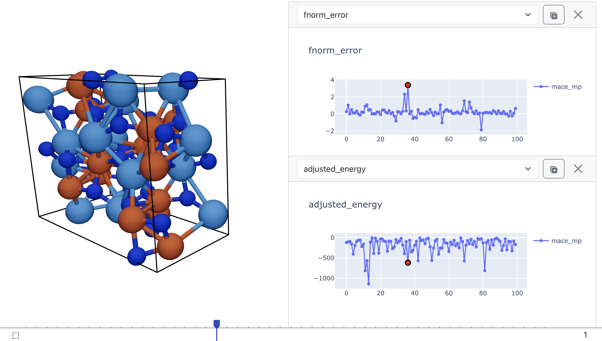

Quickstart
==========

There are two ways to use the library: as a command-line tool or as a Python library.
The CLI provides the most convenient way to get started, while the Python library offers more flexibility for advanced workflows.

.. toctree::
   :maxdepth: 2
   :hidden:

   quickstart/cli
   quickstart/python
